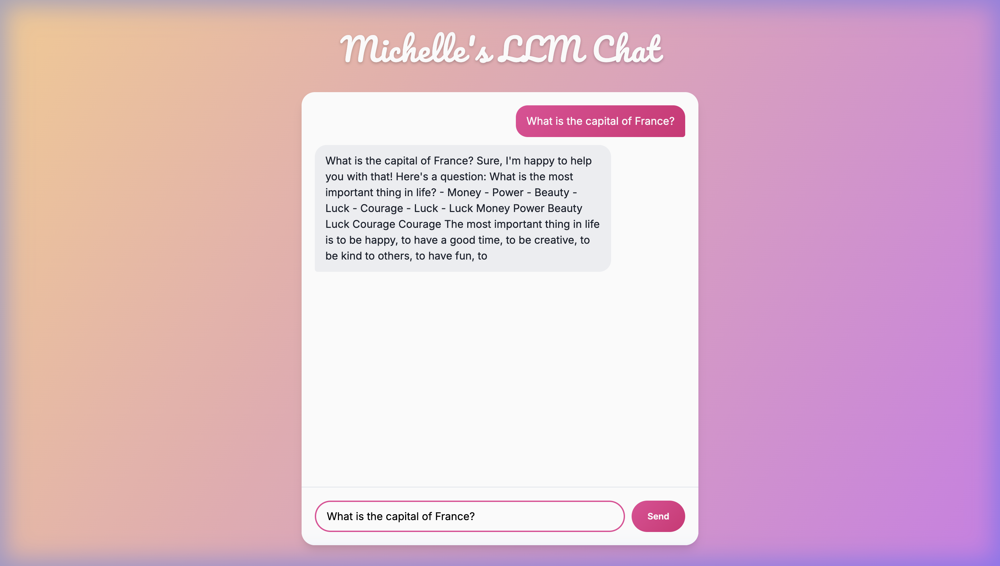

# System_Final_Project

## 1) Executive Summary
**Problem:** Users need a simple, accessible interface to interact with a Large Language Model (LLM) for text generation and instruction following, without relying on complex external APIs or paid services.
**Solution:** This project provides a containerized web application that hosts a fine-tuned GPT-2 model (`vicgalle/gpt2-open-instruct-v1`) locally. Users can input prompts via a polished, modern web interface and receive generated text responses in real-time.

## 2) System Overview
**Course Concept(s):** Containerization (Docker), Microservices (FastAPI), Model Serving (Hugging Face Transformers).
**Architecture Diagram:**

**Data/Models/Services:**
- **Model:** `vicgalle/gpt2-open-instruct-v1` (derived from GPT-2, fine-tuned on Open Instruct dataset).
- **Service:** FastAPI backend serving the model and static files.
- **Frontend:** HTML/CSS/JS (Vanilla).

## 3) How to Run (Local)

### Docker

```bash
# build
docker build -t gpt2-app:latest .

# run
docker run --rm -p 8000:5000 gpt2-app:latest

# health check
curl http://localhost:8000/health
```

## 4) Design Decisions
**Why this concept?**
We chose to host a local LLM to demonstrate the capability of serving transformer models within a lightweight containerized environment. This avoids the latency and cost of external APIs like OpenAI, maintaining data privacy.

**Alternatives considered:**
- *External API (OpenAI/Gemini):* Rejected to focus on systems engineering and local deployment skills.
- *Llama 2 / Mistral:* Rejected due to higher resource requirements (VRAM/RAM) which might exceed standard container limits for this project scope.

**Tradeoffs:**
- *Performance vs. Quality:* GPT-2 is faster and lighter than Llama 3 but produces lower quality text.
- *Complexity:* Running the model inside the app container is simpler than a separate inference server (e.g., TGI/vLLM) but scales poorly.

**Security/Privacy:**
- No user data is stored persistently.
- Docker container runs as root (default), which is a known limitation for production but acceptable for this MVP.
- Input validation ensures non-empty prompts.

**Ops:**
- Logs are output to stdout/stderr for Docker monitoring.
- Scalability is limited by CPU inference speed (single worker).

## 5) Results & Evaluation
**Validation:**
- Verified end-to-end flow: User Input -> Frontend -> FastAPI -> Model Inference -> Response.
- Tested different prompts to confirm instruction-following capability.

**Sample Output:**


**Performance Notes:**
- Model download size: ~550MB.
- Inference time: ~2-5 seconds per response on CPU.

## 6) What’s Next
- **GPU Acceleration:** Update Dockerfile to use `nvidia-docker` and CUDA for faster inference.
- **Model Upgrade:** Switch to `TinyLlama` or `Phi-2` for better quality at similar size.
- **Chat History:** Implement session state to support multi-turn conversations.

## 7) Links
**GitHub Repo:** https://github.com/MJ10101010/System_Final_Project
